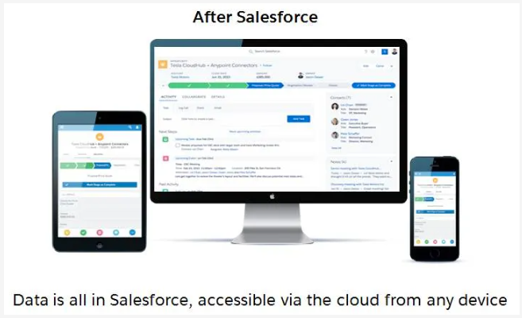
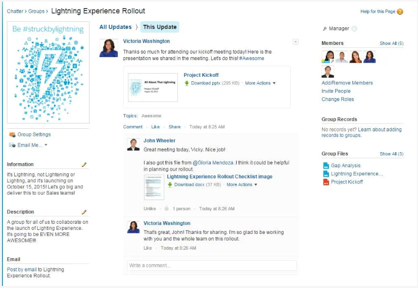
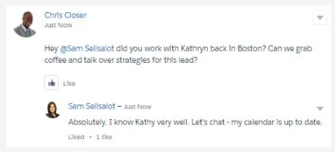
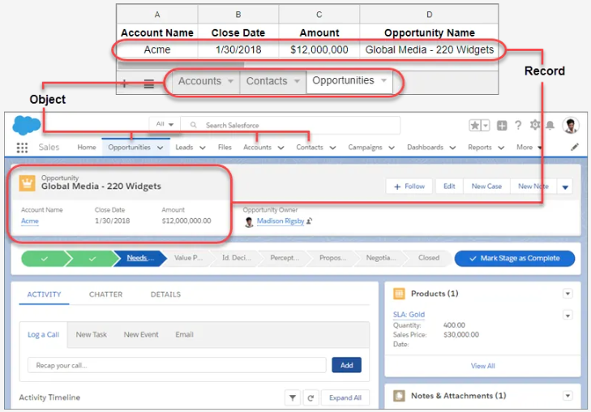
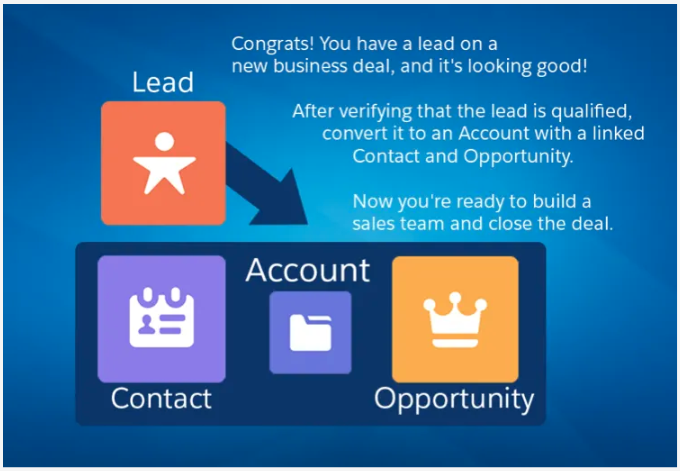

# Salesforce -> Developer Beginner -> Platform Developer I Prework

## Learning Objectives

After completing this unit, you'll be able to:

- Discover best practices for users new to Salesforce.
- Explain what Salesforce is and why you should use it.
- Describe how Salesforce objects are related and when to use each one.

## Introduction

Are you new to Salesforce? Not sure exactly what it is, or how to use it? Don’t know where you should start on your learning journey? If you’ve answered yes to any of these questions, then you’re in the right place. This module is for you.

Welcome to Salesforce! Salesforce is game-changing technology, with a host of productivity-boosting features, that will help you sell smarter and faster. As you work toward your badge for this module, we’ll take you through these features and answer the question, “What is Salesforce, anyway?”

So let’s start right there.

## What Is Salesforce?

Salesforce is your customer success platform, designed to help you sell, service, market, analyze, and connect with your customers.

Salesforce has everything you need to run your business from anywhere. Using standard products and features, you can manage relationships with prospects and customers, collaborate and engage with employees and partners, and store your data securely in the cloud.

So what does that really mean? Well, before Salesforce, your contacts, emails, follow-up tasks, and prospective deals might have been organized something like this:

If your data is stored in spreadsheets, hidden in emails or text messages, or pinned to your bulletin board, it’s hard to get the full picture of your prospective customer. And you certainly can’t access the data from anywhere, anytime, nor can your manager or executives see your progress on deals in flight, at least not without calling you for a status update.

Salesforce takes all of that important data and organizes it into a simple user interface. It’s one place for you to:

- Manage all your contacts
- Work with your prospective customers
- Organize tasks and to-do items
- Focus on the right deals
- Collaborate with your team
- Showcase your big wins
- Close more business

Simply put, Salesforce is one place for you to do stuff. And because it’s stored on our secure cloud, you can access your data anytime, anywhere, whether you’re on desktop or mobile.

When everything’s in Salesforce, you don’t need to worry about the note you left on your desk, or a file you have stored on your hard drive. You can find everything you need simply by logging in.

In addition, you no longer need to worry about updating your manager on how things are going with your top deals in flight. Instead, your manager can just log into Salesforce and see the latest data in real time.

This visibility is one of the key benefits of Salesforce. But rest assured, there are powerful security and sharing features that protect sensitive data and ensure the right folks see the right data.

## Who Sees What?

Access determines your ability to open and interact with data stored in Salesforce. The data you can create, view, edit, and delete is determined by settings your admin maintains (we’ll talk more about your admin in the next unit). Access can be simple or multilayered, depending on the complexity of your company’s needs. The important thing you need to know is that Salesforce has options for who can see and edit data, and your admin helps to set these up and maintain them.

With the right security enabled, your whole company can be on Salesforce, and one of the best reasons to do that is to harness the power of collaboration.

## Collaboration using Salesforce

In addition to technology for managing your sales process, Salesforce includes a platform for collaboration. You can create groups, follow people and topics, ask questions, post informal polls, share files and links, and mention colleagues with whom you’d like to connect.

You can also ask questions and get answers, crowdsourcing expertise from across your company. You can find experts who can help you with overcoming objections as they come up. You can search for competitive information to help you through the negotiation stage. You can get help from your leaders and teammates as you work on steps to close.

But perhaps the best part about collaborating in Salesforce is that it’s all stored for future reference. Rather than having key insights and answers to important questions living in individual email inboxes or in hallway conversations, collaboration in Salesforce is accessible and searchable. In this way, your collaboration in Salesforce can become your corporate memory, allowing you to capture and share relevant content that builds over time, increasing in value the more your whole company engages.

And because it’s in Salesforce, this is collaboration that can happen in context, right on individual deals, tasks, support issues, and more. This is the power of collaboration combined with CRM. Let's talk about that next, starting with defining what CRM is.

## What Is CRM?

CRM stands for Customer Relationship Management. This technology allows you to manage relationships with your customers and prospects and track data related to all of your interactions. It also helps teams collaborate, both internally and externally, gather insights from social media, track important metrics, and communicate via email, phone, social, and other channels.

In Salesforce, all of this information is stored securely in the cloud. Let's take a closer look at how that works, using an example you might be familiar with—a spreadsheet.

## How Salesforce Organizes Your Data

Salesforce organizes your data into objects and records. You can think of objects like a tab on a spreadsheet, and a record like a single row of data.

In Salesforce, objects are accessed via the navigation menu. Select any record to drill into a specific account, contact, opportunity, or any other record in Salesforce.

So what exactly are objects and records? Let’s take a minute to define those, along with a few other terms you’ll need to know as you continue on your Salesforce adventure.

| When we say | We mean this | Not this |
| ----------- | ------------ | -------- |
| **Record** | An item you are tracking in your database; if your data is like a spreadsheet, then a record is a row on the spreadsheet | This round thing that plays music #vinyl |
| **Field** | A place where you store a value, like a name or address; using our spreadsheet example, a field would be a column on the spreadsheet | A green meadow with flowers and grass and hopping bunnies |
| **Object** | A table in the database; in that spreadsheet example, an object is a tab on the spreadsheet | Something unidentified in the sky, with green creatures inside |
| **Org** | Short for “organization,” the place where all your data, configuration, and customization lives. You log in to access it. You might also hear this called “your instance of Salesforce” | Short for organ, meaning your heart, liver, kidneys, or possibly a big musical instrument |
| **App** | A set of fields, objects, permissions, and functionality to support a business process | A thing you download onto your phone |
| | |

So, that’s objects, records, and more, and now you have some insight into how your data is organized in Salesforce using our spreadsheet example. But unlike an actual spreadsheet, your Salesforce data is stored in our trusted, secure cloud and has an easy-to-use interface, which you can access both from the desktop and your mobile device. So it’s similar to a spreadsheet, but in Salesforce, your data is all tracked, shared, and has apps connected to it. Salesforce comes with a set of standard objects already set up and ready for use.

## Salesforce Standard Objects

Here are some of the core standard objects you’ll be using with Salesforce, and a description of how each one is used.

| | |
| -------- | ------------------------------ |
| **Accounts** | Accounts are the companies you’re doing business with. You can also do business with individual people (like solo contractors) using something called Person Accounts. |
| **Contacts** | Contacts are the people who work at an Account. |
| **Leads** | Leads are potential prospects. You haven’t yet qualified that they are ready to buy or what product they need. You don’t have to use Leads, but they can be helpful if you have team selling, or if you have different sales processes for prospects and qualified buyers. |
| **Opportunities** | Opportunities are qualified leads that you’ve converted. When you convert the Lead, you create an Account and Contact along with the Opportunity. |
| | |

Salesforce CRM allows you to manage and access your data in sophisticated ways that you could never do with a simple spreadsheet. Your records can be linked together to show how your data is related, so you can see the whole picture.

Are you a visual learner? (***`YASSS!`***) Take a look at how it fits together.

Now you understand the basics of Salesforce and the object model. But how do you actually work with leads, opportunities, contacts, and accounts? You need a productive user interface to help you sell faster and smarter. In the next unit, we’ll take you through the Salesforce user experience.
